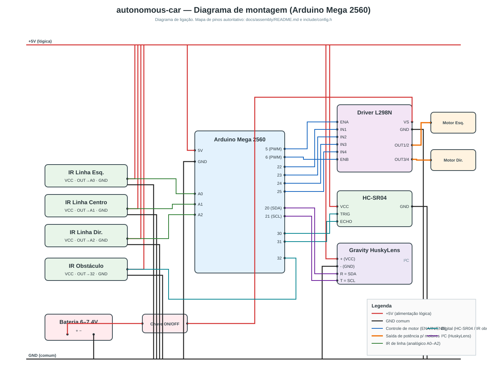

# Montagem do carro — diagrama e conexões

Documentação **completa** de montagem do `autonomous-car` (todos os componentes). Esta pasta é a referência de montagem; o mapa de pinos em código é [`include/config.h`](../../include/config.h) e deve ser mantido em sincronia.

## Conteúdo
- [`schematic.svg`](schematic.svg) — diagrama de ligação (renderiza no GitHub).
- **Matriz de conexões** e **layout** — abaixo nesta página.
- [`fritzing-guide.md`](fritzing-guide.md) — passo a passo, lista de peças e netlist para reproduzir o arquivo nativo no app Fritzing.
- [`autonomous-car.fz`](autonomous-car.fz) / [`autonomous-car.fzz`](autonomous-car.fzz) — arquivo Fritzing **best-effort** (ver aviso abaixo).

> 

## ⚠️ Aviso sobre o arquivo Fritzing (.fzz/.fz)
O `.fzz`/`.fz` incluído é **best-effort**: foi gerado como XML de sketch do Fritzing **sem** o aplicativo e **sem** os SVGs/peças da biblioteca oficial. Ao abrir no Fritzing ele pode aparecer **incompleto** (peças não resolvidas) ou exigir ajustes. **A referência confiável é este documento + o `schematic.svg` + o `fritzing-guide.md`.** Para um `.fzz` 100% fiel, siga o guia e monte no app Fritzing.

---

## Matriz de conexões

### 1. Alimentação
| De | Para | Observação |
|----|------|------------|
| Bateria (+) | Chave ON/OFF → L298N **VS** | Potência dos motores |
| Bateria (−) | **GND comum** | Liga em GND do L298N e do Mega |
| L298N **GND** | Mega **GND** | GND comum obrigatório |
| Mega **5V** | Trilho **+5V** (lógica) | Alimenta VCC dos sensores e HuskyLens |
| Mega **GND** | Trilho **GND** | Retorno comum |

> O Arduino é alimentado por USB ou fonte própria (VIN/jack). Não alimente os motores pelo 5V do Arduino. Detalhes de energia e jumper 5V do L298N em [`../hardware.md`](../hardware.md#3-energia).

### 2. Motores (L298N ↔ Mega 2560)
| L298N | Mega | Sinal |
|-------|------|-------|
| ENA | 5 (PWM) | Velocidade motor esquerdo |
| IN1 | 22 | Sentido esquerdo |
| IN2 | 23 | Sentido esquerdo |
| IN3 | 24 | Sentido direito |
| IN4 | 25 | Sentido direito |
| ENB | 6 (PWM) | Velocidade motor direito |
| OUT1/OUT2 | — | → Motor esquerdo |
| OUT3/OUT4 | — | → Motor direito |

### 3. Sensor ultrassônico HC-SR04
| HC-SR04 | Mega |
|---------|------|
| VCC | +5V |
| TRIG | 30 |
| ECHO | 31 |
| GND | GND |

### 4. Array IR seguidor de linha (3×)
| Módulo | VCC | GND | OUT (analógico) |
|--------|-----|-----|-----------------|
| IR Linha Esquerda | +5V | GND | A0 |
| IR Linha Centro   | +5V | GND | A1 |
| IR Linha Direita  | +5V | GND | A2 |

### 5. Sensor IR de obstáculo
| IR Obstáculo | Mega |
|--------------|------|
| VCC | +5V |
| OUT | 32 (LOW = obstáculo) |
| GND | GND |

### 6. Gravity HuskyLens (I²C)
| HuskyLens | Mega | Observação |
|-----------|------|------------|
| + (VCC) | +5V | |
| − (GND) | GND | |
| **R** | 20 (SDA) | No modo I²C, o pino **R = SDA** |
| **T** | 21 (SCL) | No modo I²C, o pino **T = SCL** |

> Configure a HuskyLens em *Settings → Protocol Type → I²C* (endereço `0x32`).

---

## Layout (visão de cima, esquemático)

```
        ESQUERDA                    MEGA 2560                   DIREITA
   ┌─────────────────┐                                   ┌──────────────┐
   │ IR linha E ─A0   │\                                 │   L298N      │── Motor Esq.
   │ IR linha C ─A1   │─┤ A0 A1 A2        5  6 ──────────│ ENA  ENB     │── Motor Dir.
   │ IR linha D ─A2   │/                  22 23 24 25 ───│ IN1..IN4     │
   │ IR obstác. ─32   │─────────── 32     20 21 ─────┐   │ VS ◄ chave◄ bat+
   └─────────────────┘                    30 31 ──┐  │   └──────────────┘
                                                  │  │
   ┌─────────────┐                                │  │   ┌──────────────┐
   │ Bateria +/− │── chave ──► L298N VS           │  └───│ HuskyLens R/T│ (I²C)
   └─────────────┘   bat(−) ──► GND comum         └──────│ HC-SR04 TRIG/ECHO
                                                          └──────────────┘
   Trilhos: +5V (Mega 5V) → todos os VCC   |   GND (Mega GND) → todos os GND + L298N + bat(−)
```

(Para a versão gráfica precisa, veja [`schematic.svg`](schematic.svg).)

---

## Checklist de montagem
1. [ ] Fixar chassi, motores e rodas (2 motrizes traseiras + 2 livres).
2. [ ] Montar L298N; ligar OUT1/2 → motor esq., OUT3/4 → motor dir.
3. [ ] Bateria (+) → chave → VS; bateria (−) → GND; **GND comum** L298N↔Mega.
4. [ ] Ligar ENA/IN1/IN2/IN3/IN4/ENB aos pinos 5/22/23/24/25/6.
5. [ ] Distribuir trilhos +5V (Mega 5V) e GND para os sensores.
6. [ ] HC-SR04 (TRIG 30, ECHO 31); IR linha (A0/A1/A2); IR obstáculo (32).
7. [ ] HuskyLens em I²C: R→20(SDA), T→21(SCL), +→5V, −→GND.
8. [ ] Conferir tudo contra esta matriz e `include/config.h`.
9. [ ] Gravar o firmware (`pio run -t upload`) e testar pelo Monitor Serial (ver [`../serial-control.md`](../serial-control.md)).

---

## Projeto mecânico (chassi + carroceria)

Para projetar o **chassi** e a **bolha/carroceria** com auxílio de IA, use o prompt
pronto em [`prompt-chassi-bolha.md`](prompt-chassi-bolha.md) — ele embute as restrições
do projeto, o posicionamento sensorial e pede entregáveis fabricáveis (incl. OpenSCAD).

O **projeto CAD resultante** (modelo OpenSCAD parametrizado + documentação) está em
[`cad/`](cad/): [`chassi-bolha.scad`](cad/chassi-bolha.scad) e
[`chassi-bolha.md`](cad/chassi-bolha.md). Abra o `.scad` no OpenSCAD e ajuste a variável
`part` para exportar cada peça (`base`, `tray`, `husky`, `hc_sr04`, `line_ir`, `bubble`).
