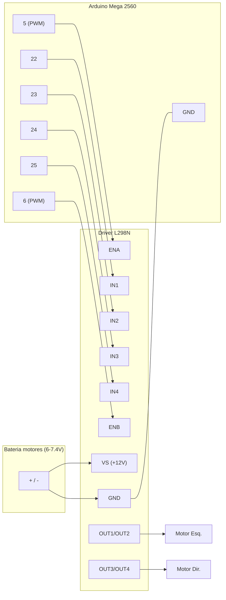

# Hardware — BOM e Pinout

## 1. Lista de Materiais (BOM)

| # | Componente | Qtd | Função | Observações |
|---|-----------|-----|--------|-------------|
| 1 | Arduino Mega 2560 | 1 | Controlador principal | 54 I/O, 16 analógicas, I²C em 20/21 |
| 2 | Chassi 2WD/4 rodas | 1 | Estrutura | 2 motores tração traseira |
| 3 | Motor DC com caixa de redução | 2 | Locomoção | tipicamente 3–6 V "TT motor" |
| 4 | Roda | 4 | — | 2 motrizes + 2 livres |
| 5 | Driver L298N | 1 | Ponte H dupla | controla 2 motores (1 canal cada) |
| 6 | Gravity HuskyLens | 1 | Visão computacional | comunicação I²C |
| 7 | Sensor ultrassônico HC-SR04 | 1 | Distância frontal | 2–400 cm |
| 8 | Módulo IR refletivo (linha) | 3 | Seguidor de linha | saída analógica |
| 9 | Sensor IR de obstáculo | 1 | Obstáculo próximo | saída digital |
| 10 | Suporte de bateria / bateria | 1 | Alimentação dos motores | ex.: 2S Li-ion ou 4–6×AA |
| 11 | Jumpers / protoboard | — | Conexões | — |
| 12 | Interruptor de energia | 1 | Liga/desliga | recomendado |

> Quantidades e modelos exatos serão refinados no **M2** (locomoção) e **M3** (sensoriamento).

## 2. Pinout (Arduino Mega 2560)

> Fonte de verdade no código: [`include/config.h`](../include/config.h). **Manter esta tabela e o `config.h` sincronizados.**

### 2.1 Motores — driver L298N

| Sinal L298N | Pino Mega | Tipo | Descrição |
|-------------|-----------|------|-----------|
| ENA | 5  | PWM | Velocidade motor esquerdo |
| IN1 | 22 | Digital | Sentido motor esquerdo |
| IN2 | 23 | Digital | Sentido motor esquerdo |
| ENB | 6  | PWM | Velocidade motor direito |
| IN3 | 24 | Digital | Sentido motor direito |
| IN4 | 25 | Digital | Sentido motor direito |
| VS  | — | Potência | Bateria dos motores (+) |
| GND | GND | — | **GND comum** com o Arduino |
| +5V | — | — | Ver jumper do regulador do L298N |

### 2.2 Sensor ultrassônico HC-SR04

| Sinal | Pino Mega | Observação |
|-------|-----------|------------|
| VCC | 5V | |
| TRIG | 30 | saída |
| ECHO | 31 | entrada (5V — OK no Mega) |
| GND | GND | |

### 2.3 Array IR seguidor de linha (3 sensores)

| Sensor | Pino Mega | Tipo |
|--------|-----------|------|
| Esquerda | A0 | Analógico |
| Centro | A1 | Analógico |
| Direita | A2 | Analógico |

Limiar linha/fundo: `IR_LINE_THRESHOLD` (calibrar em M3).

### 2.4 Sensor IR de obstáculo

| Sinal | Pino Mega | Lógica |
|-------|-----------|--------|
| OUT | 32 | Digital — `LOW` = obstáculo |

### 2.5 Gravity HuskyLens (I²C)

| Sinal | Pino Mega | Observação |
|-------|-----------|------------|
| SDA | 20 | I²C de hardware |
| SCL | 21 | I²C de hardware |
| VCC | 5V | |
| GND | GND | |

Endereço I²C padrão: `0x32`. Configure a HuskyLens em **Protocol Type: I²C** (Settings → Protocol Type).

## 3. Energia

- **Motores** alimentados pela bateria via L298N (terminal **VS/+12V**) — corrente alta.
- **Arduino** alimentado por USB ou fonte própria (VIN/jack).
- **GND comum** obrigatório entre Arduino, L298N e sensores.
- **Não** alimentar os motores pelo regulador 5V do Arduino (corrente insuficiente / risco de reset).

### Jumper de 5V do L298N
O L298N tem um regulador 5V interno e um jumper "5V-EN":
- **Bateria ≤ 12V:** jumper **fechado** → o L298N gera 5V (pode alimentar lógica leve). Ainda assim, mantenha o Arduino na sua própria fonte/USB.
- **Bateria > 12V:** jumper **aberto** e forneça 5V externos ao pino +5V do L298N.

> Dimensionamento: 2 motores "TT" típicos puxam ~200 mA cada sem carga e podem passar de 1 A travados. Uma bateria de 6–7,4 V (ex.: 2S Li-ion ou 4×AA) atende o início do projeto. Ajustar conforme os motores reais no teste de bancada.

## 4. Diagrama de ligação (L298N ↔ Mega 2560)



Versão em texto (caso o Mermaid não renderize):

```
Mega 5  ── ENA            OUT1/OUT2 ── Motor Esquerdo
Mega 22 ── IN1   L298N
Mega 23 ── IN2   (ponte)
Mega 24 ── IN3
Mega 25 ── IN4   OUT3/OUT4 ── Motor Direito
Mega 6  ── ENB
Mega GND ─ GND ─ (−) bateria        VS ── (+) bateria
```

> **Montagem completa** (todos os componentes): esquemático SVG, matriz de conexões, guia e arquivo Fritzing em [`assembly/`](assembly/README.md). O diagrama acima cobre apenas a parte de motores.
