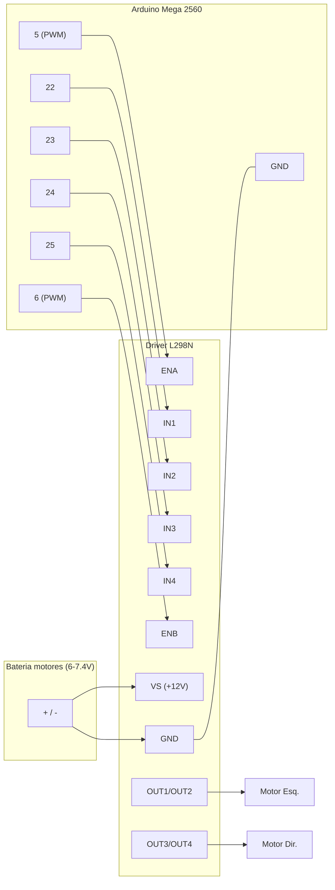

# Hardware — BOM e Pinout

## 1. Lista de Materiais (BOM)

| # | Componente | Qtd | Função | Observações |
|---|-----------|-----|--------|-------------|
| 1 | Arduino Mega 2560 | 1 | Controlador principal | 54 I/O, 16 analógicas, I²C em 20/21 |
| 2 | Chassi 2WD/4 rodas | 1 | Estrutura | 2 motores tração traseira |
| 3 | Motor DC com caixa de redução | 2 | Locomoção | tipicamente 3–6 V "TT motor" |
| 4 | Roda | 4 | — | 2 motrizes + 2 livres |
| 5 | Driver L298N | 1 | Ponte H dupla | controla 2 motores (1 canal cada) |
| 6 | Gravity HuskyLens | 1 | Visão computacional | comunicação I²C |
| 7 | Sensor ultrassônico HC-SR04 | 1 | Distância frontal | 2–400 cm |
| 8 | Módulo IR refletivo (linha) | 3 | Seguidor de linha | saída analógica |
| 9 | Sensor IR de obstáculo | 1 | Obstáculo próximo | saída digital |
| 10 | Célula 18650 (3,7 V) | 2 (ou 4) | Alimentação | 2S = 7,4 V; 2S2P (4) p/ mais autonomia. Ver §3 |
| 11 | Suporte/holder 2S 18650 | 1 | Aloja as células | evita soldar célula nua |
| 12 | Placa de proteção/BMS 2S | 1 | Segurança Li-ion | corta sobre/subtensão e curto |
| 13 | Conversor buck 5V (MP1584/LM2596) | 1 | Alimenta a lógica | 5V estável p/ Arduino + HuskyLens (recomendado) |
| 14 | Interruptor de energia | 1 | Liga/desliga | em série no `pack(+)` |
| 15 | Fusível (+ porta-fusível) | 1 | Proteção | no `pack(+)`, recomendado |
| 16 | Jumpers / protoboard | — | Conexões | — |

> Quantidades e modelos exatos serão refinados no **M2** (locomoção) e **M3** (sensoriamento).

## 2. Pinout (Arduino Mega 2560)

> Fonte de verdade no código: [`include/config.h`](../include/config.h). **Manter esta tabela e o `config.h` sincronizados.**

### 2.1 Motores — driver L298N

| Sinal L298N | Pino Mega | Tipo | Descrição |
|-------------|-----------|------|-----------|
| ENA | 5  | PWM | Velocidade motor esquerdo |
| IN1 | 22 | Digital | Sentido motor esquerdo |
| IN2 | 23 | Digital | Sentido motor esquerdo |
| ENB | 6  | PWM | Velocidade motor direito |
| IN3 | 24 | Digital | Sentido motor direito |
| IN4 | 25 | Digital | Sentido motor direito |
| VS  | — | Potência | Bateria dos motores (+) |
| GND | GND | — | **GND comum** com o Arduino |
| +5V | — | — | Ver jumper do regulador do L298N |

### 2.2 Sensor ultrassônico HC-SR04

| Sinal | Pino Mega | Observação |
|-------|-----------|------------|
| VCC | 5V | |
| TRIG | 30 | saída |
| ECHO | 31 | entrada (5V — OK no Mega) |
| GND | GND | |

### 2.3 Array IR seguidor de linha (3 sensores)

| Sensor | Pino Mega | Tipo |
|--------|-----------|------|
| Esquerda | A0 | Analógico |
| Centro | A1 | Analógico |
| Direita | A2 | Analógico |

Limiar linha/fundo: `IR_LINE_THRESHOLD` (calibrar em M3).

### 2.4 Sensor IR de obstáculo

| Sinal | Pino Mega | Lógica |
|-------|-----------|--------|
| OUT | 32 | Digital — `LOW` = obstáculo |

### 2.5 Gravity HuskyLens (I²C)

| Sinal | Pino Mega | Observação |
|-------|-----------|------------|
| SDA | 20 | I²C de hardware |
| SCL | 21 | I²C de hardware |
| VCC | 5V | |
| GND | GND | |

Endereço I²C padrão: `0x32`. Configure a HuskyLens em **Protocol Type: I²C** (Settings → Protocol Type).

## 3. Energia

Princípios:
- **Motores** alimentados pela bateria via L298N (terminal **VS**) — corrente alta.
- **GND comum** obrigatório entre bateria, L298N, Arduino e sensores.
- **Não** alimentar os motores pelo regulador 5V do Arduino (corrente insuficiente / risco de reset).

### 3.1 Bateria — quantas células 18650

A célula 18650 é **3,7 V nominal** (4,2 V em carga cheia, ~3,0 V descarregada). O sistema precisa de ~**7,4 V** para os motores (após a queda de ~1,8–2 V do L298N sobram ~5,5 V para motores TT de 3–6 V) e o VIN do Arduino quer **7–12 V**. Logo:

| Arranjo | Tensão (nominal / cheia / vazia) | Capacidade | Uso |
|---------|----------------------------------|------------|-----|
| 1 célula (1S) | 3,7 / 4,2 / 3,0 V | 1× | ❌ baixa demais (motores e VIN não funcionam) |
| **2 em série (2S)** | **7,4 / 8,4 / 6,0 V** | 1× | ✅ **mínimo recomendado** |
| 4 em 2S2P | 7,4 / 8,4 / 6,0 V | 2× | ✅ mais autonomia (2 séries em paralelo) |

O **paralelo (2P)** não muda a tensão, apenas dobra a capacidade — só com células **idênticas e no mesmo estado de carga**.

> ⚠️ **"9800 mAh" em 18650 é especificação falsa.** Células reais têm ~**2500–3500 mAh** (Samsung, LG, Sony/Murata, Panasonic). Não dimensione autonomia pelo rótulo de células genéricas.

### 3.2 Como ligar (2S)

```
   Célula A            Célula B
  (+)──(−) ── fio ──  (+)──(−)
   │                       │
 pack(+) 8,4V          pack(−)/GND
   │                       │
 [Chave ON/OFF]            ├── GND do L298N
   │                       └── GND do Arduino   (GND COMUM)
   ├── VS do L298N (potência dos motores)
   └── entrada do buck 5V  → 5V do Arduino + VCC da HuskyLens/sensores
```

1. **Série:** ligue **(+) de uma célula ao (−) da outra**; sobram `pack(+)` e `pack(−)`.
2. **Chave ON/OFF** em série no `pack(+)`.
3. `pack(+)` → **VS** do L298N. `pack(−)` → **GND comum** (L298N + Arduino).
4. **Lógica:** ver 3.3.

### 3.3 Alimentação da lógica (Arduino + HuskyLens)

- **Simples:** `pack(+)` também no **VIN** do Arduino. Funciona, mas perto do fim da carga (~6 V) o regulador do Mega pode dar *brownout*/reset, e a HuskyLens (~0,3–0,5 A) aquece o regulador.
- **Recomendado:** um **conversor buck 5 V** (MP1584 / LM2596) do `pack(+)` → **pino 5V** do Arduino e VCC da HuskyLens/sensores. Entrega 5 V estáveis e isola a lógica dos picos dos motores. Mantenha o GND comum.

### 3.4 Jumper de 5V do L298N
O L298N tem regulador 5V interno e um jumper "5V-EN":
- **VS ≤ 12 V** (nosso caso, 2S): jumper **fechado** → o L298N gera 5V (pode alimentar lógica leve). Ainda assim, prefira o buck/USB para o Arduino.
- **VS > 12 V:** jumper **aberto**; forneça 5V externos ao pino +5V do L298N.

### 3.5 Segurança Li-ion (não pule)
- Use **suporte (holder) 2S** + **placa de proteção/BMS 2S** (corta sobre/subtensão e curto). Evite soldar célula nua.
- **Carregue com carregador 2S balanceado** (ou BMS com balanceamento). Não descarregue abaixo de ~3,0 V/célula.
- **Polaridade correta**; recomendável um **fusível** no `pack(+)`. Evite células de procedência duvidosa (risco térmico).

> Dimensionamento de corrente: 2 motores TT puxam ~200 mA cada sem carga e podem passar de 1 A travados; HuskyLens ~0,3–0,5 A; lógica ~0,1 A. Ajuste conforme os motores reais no teste de bancada (ver [`bench-test.md`](bench-test.md)).

## 4. Diagrama de ligação (L298N ↔ Mega 2560)



Versão em texto (caso o Mermaid não renderize):

```
Mega 5  ── ENA            OUT1/OUT2 ── Motor Esquerdo
Mega 22 ── IN1   L298N
Mega 23 ── IN2   (ponte)
Mega 24 ── IN3
Mega 25 ── IN4   OUT3/OUT4 ── Motor Direito
Mega 6  ── ENB
Mega GND ─ GND ─ (−) bateria        VS ── (+) bateria
```

> **Montagem completa** (todos os componentes): esquemático SVG, matriz de conexões, guia e arquivo Fritzing em [`assembly/`](assembly/README.md). O diagrama acima cobre apenas a parte de motores.
